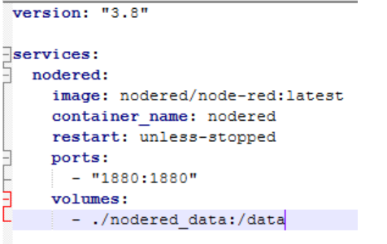
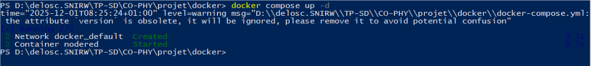
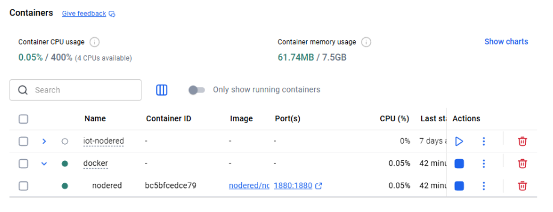
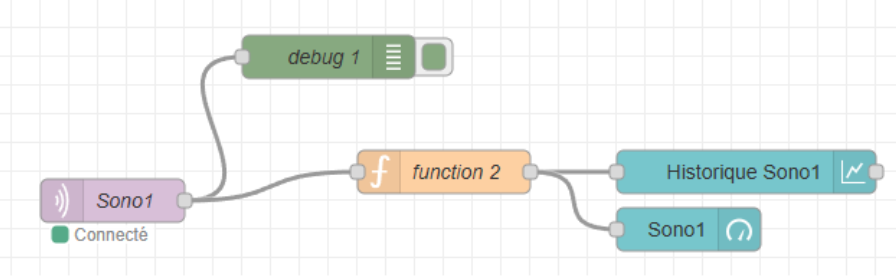
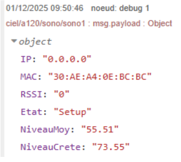
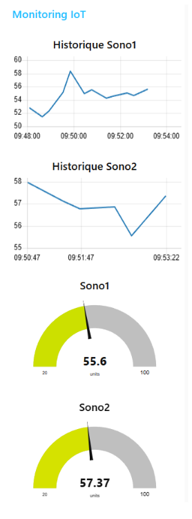

# Compte-rendu projet node-red

Mise en place du fichier docker-compose.yml

Lancement de node-red

Containers Docker

Récupération des données CO2 via MQTT depuis le topic ciel/a120/co2/co21 sur le broker Mosquitto.

Récupération des fichiers de données via broker MQTT, comme node-red tourne sur docker,
il n’a pas accès au réseau local donc ne peut pas directement recevoir les données.
J’ai donc installé socat pour créer un proxy TCP entre localhost:1883 et 172.17.50.232:1883.

Premier flow :
(en violet) Connexion au broker MQTT pour récupérer les données qui y sont stockées.
(en beige) Code fonction pour lire les données que l’on récupère du broker
(en bleu) Utilisation d’un histogramme et d’une jauge pour pour présenter les données après les avoir traitées.
(en vert) Debug pour voir à quoi ressemble les données que je reçois afin de pouvoir remplir le code fonction

Réception du payload en format JSON

Interface graphique node-red

